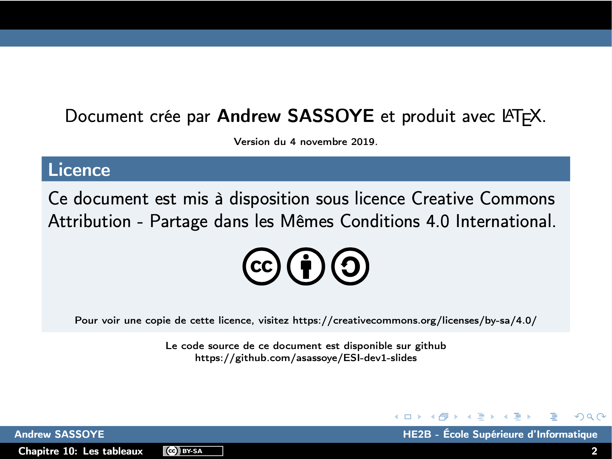

# [DEV1] Cours de développement - Slides


## Compilation
```
$ make pdf
```

## Structure du projet
```
.
├── contents
│   ├── exercices
│   │   ├── declaration-et-creation.tex
│   │   ├── java
│   │   │   ├── AlgorithmeInitialisation.java
│   │   │   └── SyllabusExercice99.java
│   │   ├── tableau-en-argument-ou-en-retour.tex
│   │   ├── tableaux-a-plusieurs-indices.tex
│   │   └── utilisation.tex
│   ├── exercices.tex
│   ├── theorie
│   │   ├── declaration-et-creation
│   │   │   ├── creation-de-tableaux.tex
│   │   │   ├── declaration-de-tableaux.tex
│   │   │   ├── images
│   │   │   │   ├── objects-tenElementArray.gif
│   │   │   │   └── objects-tenElementArray.pdf
│   │   │   ├── introduction.tex
│   │   │   └── java
│   │   │       ├── Declaration.java
│   │   │       ├── Initialiseur.java
│   │   │       ├── OperateurNew.java
│   │   │       └── SansInitialiseur.java
│   │   ├── declaration-et-creation.tex
│   │   ├── tableau-en-argument-ou-en-retour
│   │   │   └── java
│   │   │       ├── TableauEnArgument.java
│   │   │       └── TableauEnRetour.java
│   │   ├── tableau-en-argument-ou-en-retour.tex
│   │   ├── tableaux-a-plusieurs-indices.tex
│   │   ├── utilisation
│   │   │   ├── acces-individuel-aux-elements-dun-tableau.tex
│   │   │   ├── affectation-de-tableaux.tex
│   │   │   ├── boucle-foreach.tex
│   │   │   ├── java
│   │   │   │   ├── Acces.class
│   │   │   │   ├── Acces.java
│   │   │   │   ├── Affectation.class
│   │   │   │   ├── Affectation.java
│   │   │   │   ├── Affectation.txt
│   │   │   │   ├── error.txt
│   │   │   │   ├── ForEach.java
│   │   │   │   ├── Length.java
│   │   │   │   └── ParcourirTableau.java
│   │   │   └── la-taille-dun-tableau.tex
│   │   └── utilisation.tex
│   └── theorie.tex
├── LICENSE
├── main.tex
├── Makefile
├── README.md
└── styles
    ├── esi-beamer.sty
    └── images
        ├── by.pdf
        ├── by-sa.pdf
        ├── cc.pdf
        ├── esi-logo.pdf
        ├── preview1.png
        ├── preview2.png
        └── sa.pdf
```